# "TRS-GPT" : ChatGPT from a TRS-80 Model III Computer built in 1981

If you want to skip ahead, and simply see the final, working project, then [CLICK HERE](https://youtu.be/hENzaGMYdL8)

When I was a kid, around 1985, I got an [Atari 800XL](https://www.computinghistory.org.uk/det/3959/Atari-800XL/), 

<kbd>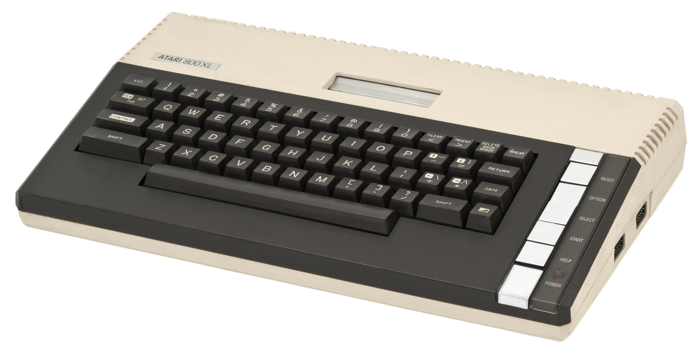Atari 800XL, picture courtesy Wikipedia</kbd>
&nbsp;  
&nbsp;  

It was the most joyous and addicting toy I had ever experienced, especially since it had games like [Zork](https://en.wikipedia.org/wiki/Zork):

<kbd>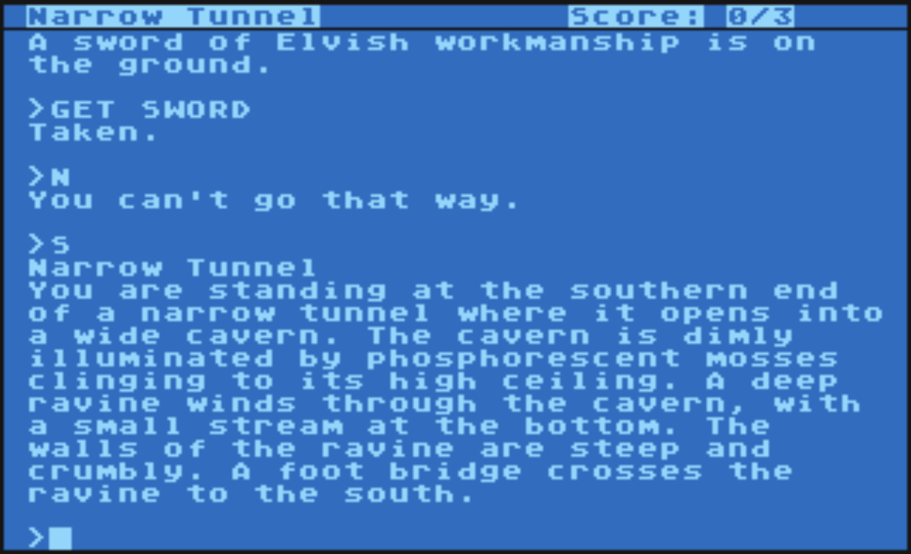 *Zork II, picture courtesy www.atarimania.com*</kbd>
&nbsp;  
&nbsp; 

Thinking back, I often tell others that I greatly improved my reading and vocabulary skills while playing games such as Zork on a CRT television connected to the Atari computer.
As I played games, I became curious about how they were made, and I discovered the [BASIC programming language](https://en.wikipedia.org/wiki/BASIC).  
<kbd>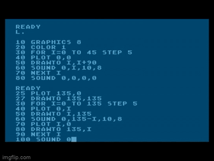*example courtesy of https://www.youtube.com/@mmille10*</kbd>
<br/><br/>
Although only the basics of the language made sense to me, I got a kick out of painstakingly, manually typing in long programs that did cool things from my subscription to [Antic Magazine](https://www.atarimagazines.com/antic/):

<kbd>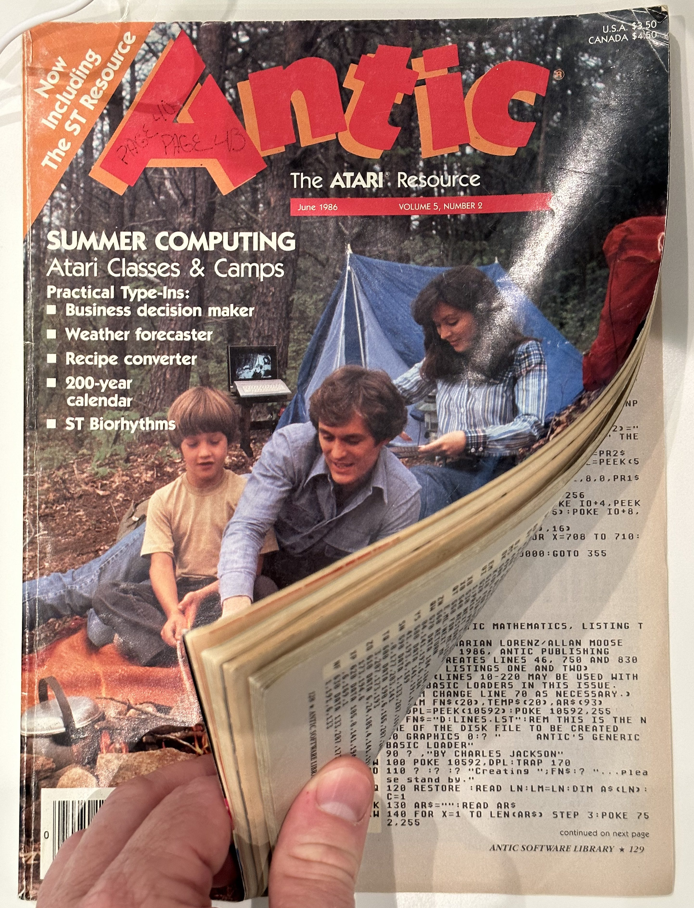My Antic magazine, 1986</kbd>
&nbsp;  
&nbsp; 

But what I really wanted to write was an interactive program like Zork, but where I could chat with it, and it would be able to hold an intelligent conversation with me.  In other words, it has always been my dream to have [artificial general intelligence](https://en.wikipedia.org/wiki/Artificial_general_intelligence) on my Atari.  This goal was especially inspired by movies such as [War Games](https://www.imdb.com/title/tt0086567/):

<kbd>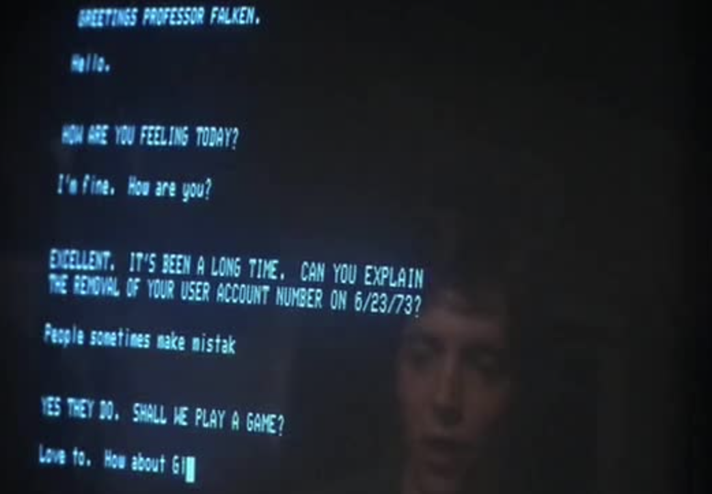War Games Movie - 1983</kbd>
<br/><br/>

Fast forward about 40 years…

I’m now a middle-aged man with multiple degrees, working for NASA JPL.  For all of these years, I've kept alive the childhood dream of interacting (chatting) with the computer in an intelligent way.

This year, 2023, two things happened, that allowed me to “close the loop” on my childhood dream:
- **Something called [ChatGPT](https://openai.com/blog/chatgpt) became a thing**
- **Someone at work gave me a free [TRS-80 Model III](http://www.trs-80.org/model-3/) (built in 1981) computer**

As a kid, I remember friends talking about the TRS-80, referring to it as the “trash 80”.  So my expectations weren’t that high, but I realized that it looked pretty retro, had about the same resolution as my old Atari 800XL, and it ran BASIC!  

When I opened the box, and fired it up (at least the thing powered on), I quickly realized that only about 10% of the keys actually worked.

I proceeded to take apart the computer, and one-by-one de-soldered each key, disassembled the mechanisms in each one, cleaned the contacts, put the key back together, and soldered the whole keyboard back together.  Thanks to [this great video](https://www.youtube.com/watch?v=qaxfMWPJzBQ), I was really about to understand the process of keyboard restoration.

<kbd>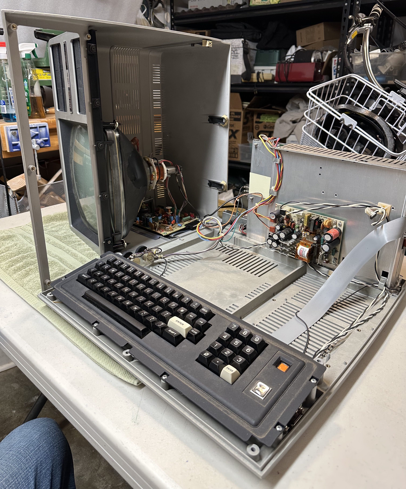The TRS-80, opened up</kbd>
<br/><br/>
<kbd>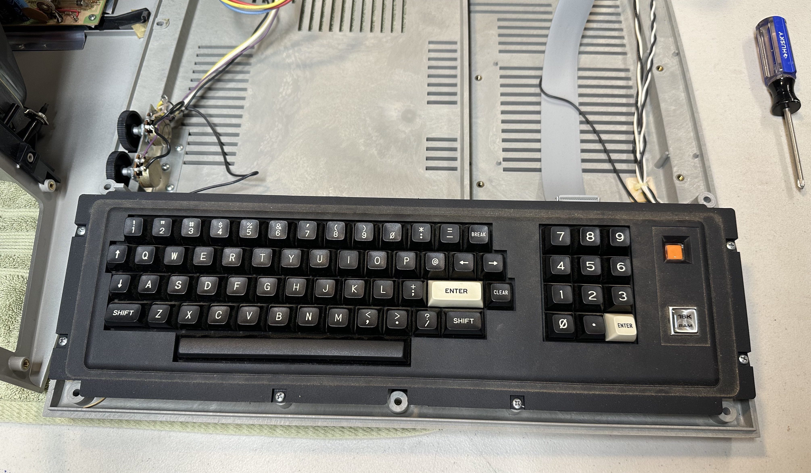a top-down view of the keyboard</kbd>
<br/><br/>
<kbd>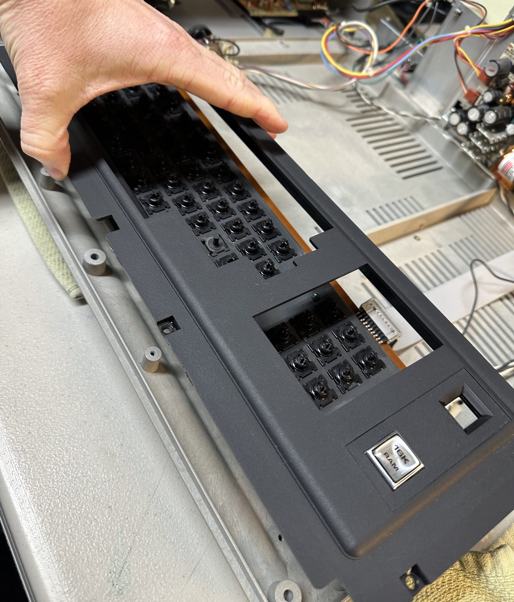disassembling the keyboard</kbd>
<br/><br/>
<kbd>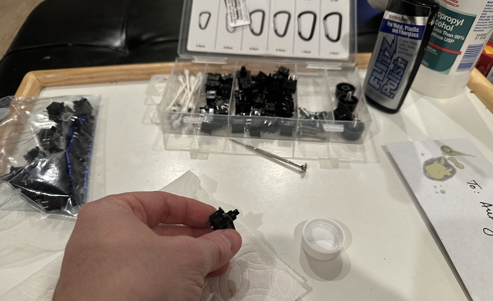cleaning a key</kbd>
<br/><br/>
<kbd>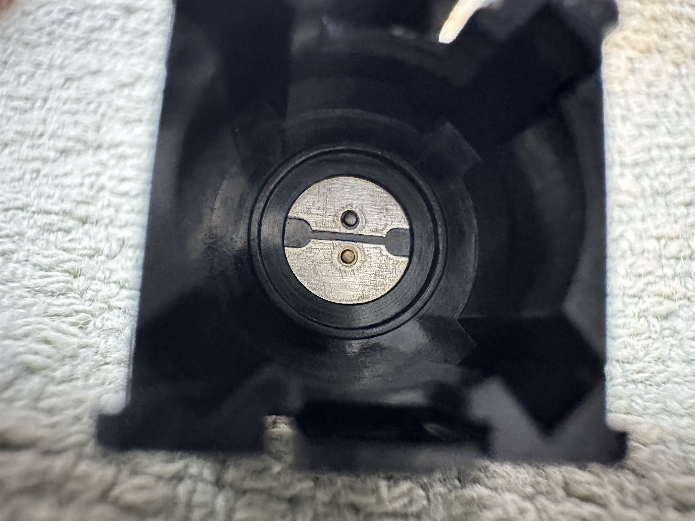close-up view of a key contact</kbd>
<br/><br/>
<kbd>soldering the keyboard back together</kbd>
<br/><br/>

After this, I had a working, beautiful TRS-80, with fully-functional keys!

<kbd>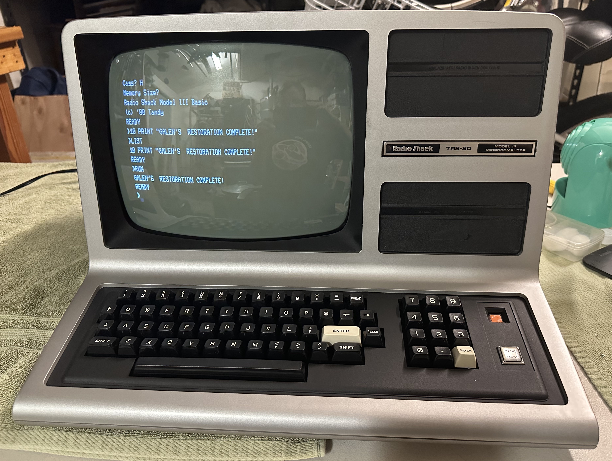shiny, brand-new, restored TRS-80 Model III!</kbd>
<br/><br/>

Then I realized that I didn’t even have a hard drive to store BASIC programs (or anything) on.  Should I track down and buy a TRS-80 floppy drive from someone on Ebay?  No, this is 2023, and I wanted to follow a more modern approach!  I did some searches online, and found Ian Mavric, the “Australian TRS-80 Recycler”, and figured out I could get a FreHD module, which essentially allows one to plug an external board with a microSD card, into the serial ribbon cable input on the back of the TRS-80, which would emulate a hard drive.  Ian was selling the the “FreHD Clearly Superior Kit for M3/4”, which supposedly worked for my needs.  It was “clearly superior”, so it had to be the right choice for me.   I ordered the kit, and set it up, which also involved replacing a certain ROM chip.

<kbd>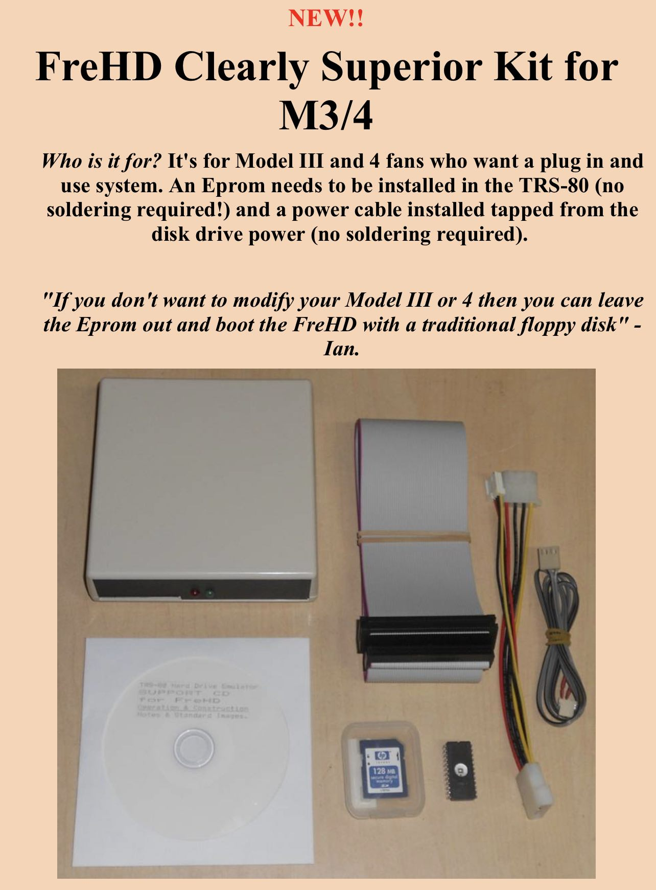FreHD Clearly Superior Kit for M3/4!</kbd>
<br/><br/>

Ian was really helpful, and after a few emails with him, and determining that my system actually had the needed 48K of RAM, I hooked it up!
I was now able to play games like Microchess 1.5 (copyright 1978)
<kbd>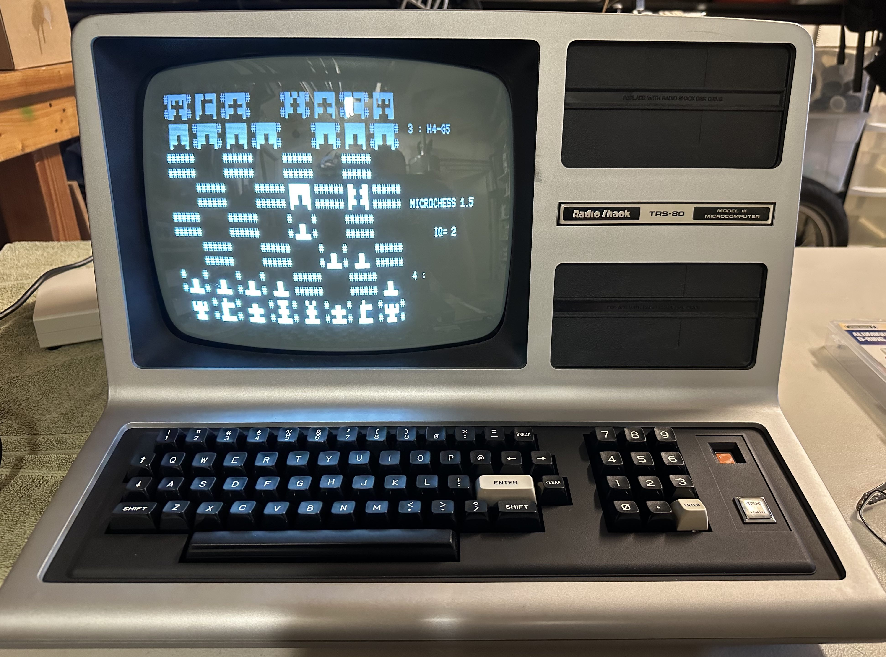Microchess 1.5 (copyright 1978)</kbd>
<br/><br/>
<kbd>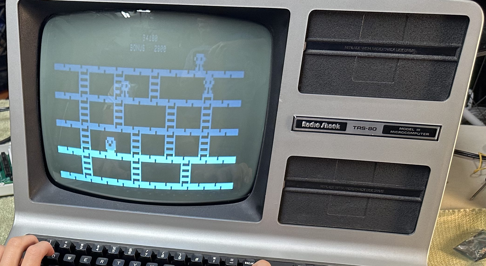Apple Panic, the game</kbd>
<br/><br/>
<kbd>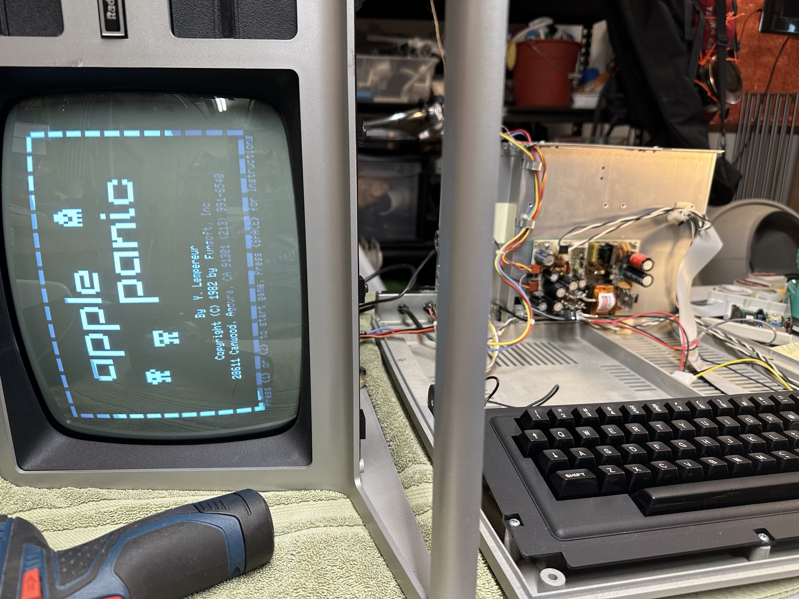Apple Panic, the game</kbd>
<br/><br/>

And then it dawned on me that to achieve my goal of intelligent discussion with my computer, I really needed my TRS-80 to hook up to the internet (so that I could talk to OpenAI/ChatGPT).  As good as the FreHD Clearly Superior Kit was, I apparently needed something a bit more Superior.  I did more more internet searching, and found the TRS-IO.  
https://github.com/apuder/TRS-IO

<kbd>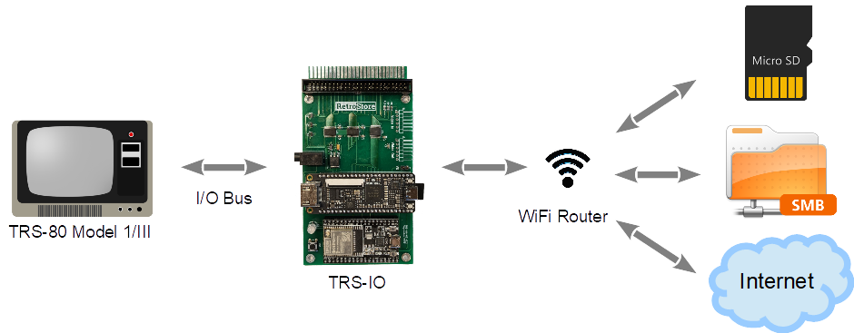Overview of the TRS-IO, courtesy of [Arno Puder](https://github.com/apuder/TRS-IO)</kbd>
<br/><br/>

The TRS-IO promised to be a solution that would provide the capability to both store programs, and access the internet.  I could even take the micro-SD card that I had with my superior device, and and use it here.  So I ordered the TRS-IO from [Arno Puder](https://github.com/apuder), and swapped it in for my superior kit.

<kbd>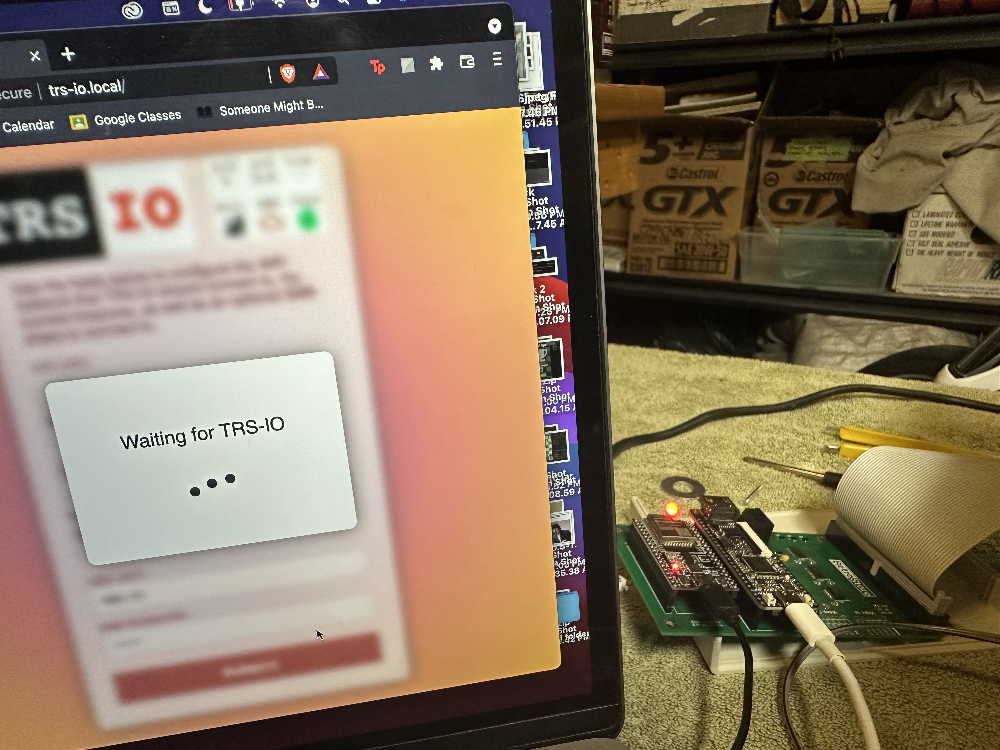Connecting and configuring the TRS-IO to use the WiFi</kbd>
<br/><br/>

After connecting it, and configuring it to connect to my Wi-Fi, which took me a while to figure out, because, who knew, but I needed to actually connect the antenna, I was up and running, able to explore some example programs in BASIC that connected to the [WHOIS](https://www.iana.org/whois) server to make requests.  Arno provided some [super useful starter example code](https://github.com/apuder/TRS-IO/blob/master/examples/trs-nic/WHOIS.BAS) for this, that I was able to play around with to see how things work:

In order to pass text queries entered on the TRS-80 to the OpenAI server, I first came up with a plan to implement an AWS lambda function, sitting behind an API Gateway that passed the query to OpenAI, then returned the response back the TRS-80. 
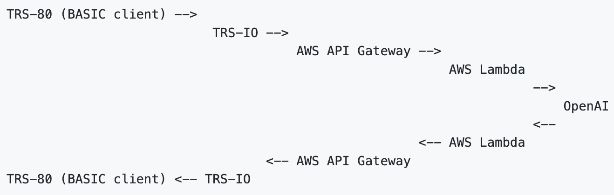*my first attempt at the topology*
<br/><br/>

After getting the lambda working and tested, I was very happy, until I realized that API Gateway only supports HTTPS connections.  Netscape Communications created HTTPS in 1994 for its Netscape Navigator web browser, a good 13 years after my computer was built!  Additionally the TRS-LIB (part of TRS-IO) did not support secure connections out-of-the-box.  So I decided to go a bit more old school, and get as close to the implementation of the WHOIS, port 43 protocol as possible, to avoid messing around in the BASIC language too much.  So I settled on implementing a simple EC2 server hosting a Python server program, listening on the same port as the original WHOIS server example:

<kbd>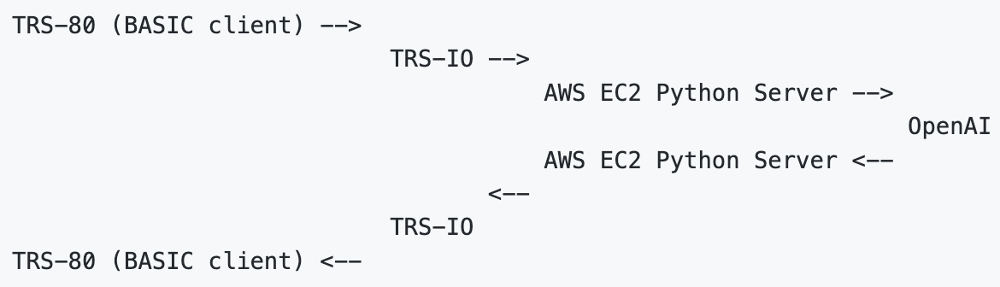final, working architecture</kbd>
<br/><br/>

### TRSGPT.BAS (the client-side program):
[https://github.com/druid77/trs-gpt/blob/main/TRSGPT.BAS](https://github.com/druid77/trs-gpt/blob/main/TRSGPT.BAS)

```BASIC
5 PRINT "Running network program..."
10 REM whois
13 H$ "<REDACTED_IP_ADDRESS_OF_EC2_PYTHON>"
15 REM OPEN A TCP/IP SOCKET
20 OUT 236,16  	:REM ENABLE MODEL III BUS
25 OUT 31,1
30 OUT 31,1		:REM SOCKET COMMAND
40 OUT 31,1		:REM USE IPV4
50 OUT 31,1		:REM
57 GOSUB 1000
60 Y=INP(31)	:REM GET THE STATUS
70 IF Y <> 0 THEN PRINT "ERROR OPENING SOCKET": GOTO 500
80 SOCKFD=INP(31)	:REM STORE THE SOCKET FILE DESCRIPTOR
90 PRINT "THE SOCKET IS OPEN "
100 REM CONNECT TO THE SERVER
105 OUT 31,1
110 OUT 31,3	:REM CONNECT COMMAND
115 OUT 31,SOCKFD
117 L = LEN(H$)
118 FOR T = 1 TO L
119 T$ = MID$(H$,T,1)
120 OUT 31,ASC(T$)
121 NEXT T
122 OUT 31,0	:REM NULL ENDS HOSTNAME
123 OUT 31,43	:REM PORT LSB
124 OUT 31,0	:REM PORT MSB
125 GOSUB 1000
130 Y = INP(31)
140 IF Y <> 0 THEN PRINT "ERROR CONNECTING TO WHOIS SERVER": GOTO 500
150 PRINT " "
160 REM SEND QUERY
161 INPUT Q$
162 IF Q$ = "by" THEN GOTO 500
163 L = LEN(Q$)
166 L = LEN(Q$)
167 OUT 31,1
170 OUT 31,4
171 OUT 31,SOCKFD
172 OUT 31,L+2:OUT 31,0: OUT 31,0: OUT 31,0
180 FOR T = 1 TO L:T$=MID$(Q$,T,1):OUT 31,ASC(T$):NEXT T
184 OUT 31,13
185 OUT 31,10
186 GOSUB 1000
187 FOR T = 1 TO 5: Y=INP(31): NEXT T
200 REM RECEIVE THE DATA
201 OUT 31,1
202 OUT 31,6
204 OUT 31,SOCKFD
206 OUT 31,0	:REM USE BLOCKING FOR NIST DAYTIME SERVICE
208 OUT 31,255:OUT 31,255:OUT 31,0:OUT 31,0		:REM DATA LENGTH REQUESTED
210 GOSUB 1000
220 Y = INP(31)
230 IF Y <> 0 THEN PRINT "ERROR RECEIVING": GOTO 500
240 L1 = INP(31):L2 = INP(31):L3 = INP(31):L4 = INP(31)
250 L = (L2 * 256) + L1
260 FOR T = 1 TO L: Y=INP(31): PRINT CHR$(Y);:NEXT T
300 PRINT 
310 PRINT "...DONE RECEIVING DATA FROM WHOIS"
500 REM CLOSE
505 OUT 31,1
510 OUT 31,8
520 OUT 31,SOCKFD
525 GOSUB 1000
530 Y = INP(31)
540 IF Y <> 0 THEN PRINT "Error on socket close (line 540)"
544 IF Q$ = "bye" THEN GOTO 549
545 GOTO 20
549 PRINT "..."
550 END
1000 IF PEEK(293) = 73 THEN GOTO 1030
1010 IF (PEEK(14304) AND 32) <> 0 THEN GOTO 1010
1020 RETURN
1030 IF (INP(224) AND 8) <> 0 THEN GOTO 1030
1040 RETURN
```

### For the server side (AWS EC2 Python Server), I wrote a simple program like this:
[https://github.com/druid77/trs-gpt/blob/main/server.py](https://github.com/druid77/trs-gpt/blob/main/server.py)

```python
import socket
import os
import json
import openai

OPENAI_MODEL = "gpt-3.5-turbo"
openai.api_key = "<REDACTED>"
conversation = []

def do_open_ai_query(chat_input):
    try:

        # Make a call to the OpenAI API to get the chat GPT response
        completion = openai.ChatCompletion.create(
            model=OPENAI_MODEL,
            messages=[
                {
                    "role": "user",
                    "content":  chat_input
                }
            ])

        return completion.choices[0].message.content

    except Exception as e:
        return {
            'statusCode': 500,
            'body': json.dumps({'error': str(e)})
        }

def chat_with_gpt3(messages):
    response = openai.ChatCompletion.create(
        model=OPENAI_MODEL,
        messages=messages
    )
    return response.choices[0].message['content']


def handle_client(client_socket):
    user_input = client_socket.recv(1024).decode()
    print(f"Received data from client: {user_input}")

    conversation.append({"role": "user", "content": user_input})

    response = chat_with_gpt3(conversation)

    conversation.append({"role": "assistant", "content": response})

    client_socket.send(response.encode())
    client_socket.close()

def main():
    host = '0.0.0.0'
    port = 43

    server_socket = socket.socket(socket.AF_INET, socket.SOCK_STREAM)
    server_socket.bind((host, port))
    server_socket.listen(5)

    print(f"Server listening on port {port}")

    while True:
        client_socket, client_addr = server_socket.accept()
        print(f"Accepted connection from {client_addr}")
        handle_client(client_socket)

if __name__ == "__main__":
    main()
```

Soon, I had my first successful communication with ChatGPT:
<kbd>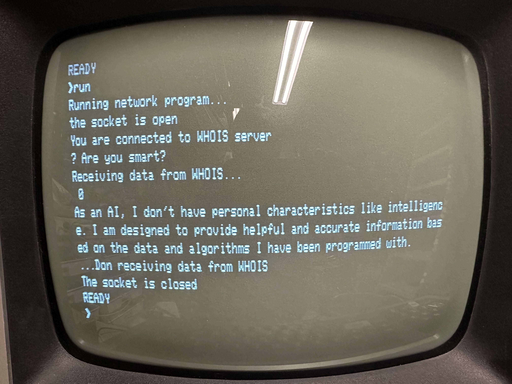First successful communication with ChatGPT!</kbd>
<br/><br/>

I realized, I had to make some more improvements/modifications to the BASIC program, to have it:
 1. Setup and open the socket
 2. Prompt user for query
 3. Send query over the socket
 4. Close and cleanup the socket
 5. Cycle back to step 1

### After these modifications, I was able to interact with ChatGPT on my TRS-80!

# [CLICK HERE TO WATCH THE FINAL WORKING SYSTEM!!](https://youtu.be/hENzaGMYdL8)
<a href="https://youtu.be/hENzaGMYdL8">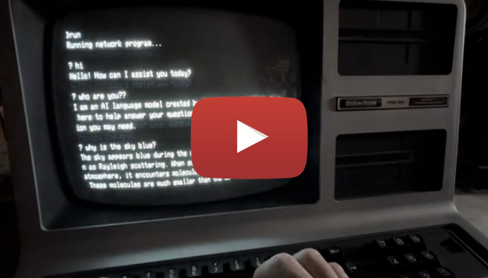*ChatGPT on the TRS-80!*</a>
<br/><br/>
I hope you enjoyed reading about my journey to get a retro computer connecting to the modern world!
